# CrossMind Architecture

## System Overview

CrossMind is a neuro-symbolic scientific discovery stack. The runtime is organized into four logical layers, though the physical directory layout is still evolving.

## Layer Diagram

```mermaid
flowchart TB
    subgraph "Client Layer"
        Streamlit["Streamlit Dashboard<br/>dashboard/app.py"]
        React["React Frontend<br/>frontend/src/ (disabled by default)"]
        API_Client["Direct API Clients"]
    end

    subgraph "Application Layer (app/)"
        FastAPI["FastAPI Entrypoint<br/>app/main.py (343 lines)"]
        Observability["Observability<br/>app/observability.py"]
        Schemas["Pydantic Schemas<br/>app/schemas.py"]
    end

    subgraph "Core Reasoning Layer (reasoning/)"
        Pipeline["NeuroSymbolicPipeline<br/>reasoning/neuro_symbolic_pipeline.py"]
        Strategy["UnifiedRouter / QualityGate / CostController<br/>reasoning/strategy_layer.py"]
        MultiAgent["MultiAgentOrchestrator<br/>reasoning/multi_agent.py"]
        Agents["Specialist Agents (10 domains)<br/>reasoning/agent_registry.py"]
        Memory["Dual Memory / MemoryService<br/>reasoning/dual_memory.py, memory_service.py"]
        KG["KnowledgeGraph / GraphRAG<br/>reasoning/knowledge_graph.py, hybrid_rag_kg.py"]
        Validation["Z3 Validator / Symbolic Filter<br/>reasoning/z3_validator.py, symbolic_filter.py"]
        Routing["Query Classifier / WFA / DecisionTree<br/>reasoning/query_classifier.py, wfa_fast_path.py, decision_tree.py"]
    end

    subgraph "Infrastructure Layer (infra/)"
        Qdrant["Qdrant Vector Engine<br/>vector_store/qdrant_engine.py"]
        Redis["Redis Cache<br/>ingestion/redis_cache.py"]
        Neo4j["Neo4j Graph (optional)<br/>reasoning/neo4j_graph.py"]
        Embedding["BGE-M3 Embedder<br/>ingestion/embedding.py"]
    end

    subgraph "Service Layer (services/)"
        Ingestion["IngestionPipeline<br/>ingestion/pipeline.py"]
        Continuous["Continuous Ingestion<br/>ingestion/continuous_ingestion.py"]
        Feedback["Feedback / Retrainer / Rule Engine<br/>reasoning/feedback_collector.py, retrainer.py, rule_engine.py"]
    end

    subgraph "Deployment & Observability"
        Docker["Docker Compose<br/>docker-compose.yml"]
        K8s["Kubernetes Manifests<br/>kubernetes/"]
        Prometheus["Prometheus / Grafana<br/>monitoring/"]
        Jaeger["Jaeger Tracing<br/>(docker-compose)"]
    end

    Streamlit --> FastAPI
    React --> FastAPI
    API_Client --> FastAPI

    FastAPI --> Pipeline
    FastAPI --> Observability
    FastAPI --> Schemas

    Pipeline --> Strategy
    Pipeline --> MultiAgent
    Pipeline --> Memory
    Pipeline --> KG
    Pipeline --> Validation
    Pipeline --> Routing

    Pipeline --> Qdrant
    Pipeline --> Redis
    Pipeline --> Neo4j
    Pipeline --> Embedding

    Ingestion --> Qdrant
    Ingestion --> Redis
    Ingestion --> Embedding

    Feedback --> Memory
    Feedback --> KG

    Docker --> FastAPI
    Docker --> Qdrant
    Docker --> Redis
    Docker --> Neo4j
    Docker --> Jaeger
    Docker --> Prometheus
    Docker --> Streamlit

    K8s --> Docker
    Prometheus --> Observability
```

## Component Status

| Component | Location | Status | Notes |
|-----------|----------|--------|-------|
| FastAPI `app` object | `app/main.py` | **Implemented** | Full FastAPI app with `/api/query`, `/api/ingest`, `/api/stream_reasoning`, `/v1/api/*` aliases, auth, versioning, validation, streaming, metrics, health. 343 lines. |
| Observability | `app/observability.py` | **Implemented** | Prometheus metrics + OpenTelemetry with graceful fallback. |
| Schemas | `app/schemas.py` | **Implemented** | Pydantic v2 models for requests/responses. |
| Core package | `core/` | **Structural** | Contains only `__init__.py`. Intended: orchestration factories. Current: responsibilities live in `reasoning/`. |
| Infra package | `infra/` | **Structural** | Contains only `__init__.py`. Intended: storage/cache adapters. Current: implementations live in `vector_store/` and `ingestion/`. |
| Services package | `services/` | **Structural** | Contains only `__init__.py`. Intended: service entry points. Current: implementations live in `ingestion/` and `reasoning/`. |
| Reasoning layer | `reasoning/` (50+ files) | **Implemented** | Full neuro-symbolic pipeline, multi-agent, strategy routing, KG, validation, memory. |
| Ingestion pipeline | `ingestion/` | **Implemented** | Document extraction, chunking, embedding, caching. |
| Vector store | `vector_store/` | **Implemented** | Qdrant client with in-memory fallback, BM25, vector adapter. |
| Streamlit dashboard | `dashboard/app.py` | **Implemented** | 633-line authenticated dashboard with metrics and visualization. |
| Kubernetes manifests | `kubernetes/` and `kubernetes/base/` | **Implemented** | Base manifests (deployment, service, ingress, HPA, PDB, networkpolicy, configmap, secret, SA, namespace) + loose manifests (autoscaling, ingress-https). Deploy via kustomize or `helm/crossmind/` chart. |
| Helm charts | `helm/crossmind/` | **Implemented** | Production chart with deployment, HPA, ingress, service, configmap, secret, SA, PDB, networkpolicy templates. |
| Monitoring | `monitoring/` | **Implemented** | Prometheus scrape config + Grafana provisioning + overview dashboard JSON. |
| Docker Compose | `docker-compose.yml` | **Implemented** | Full stack: Redis, Qdrant, Neo4j, Jaeger, vLLM, API, Dashboard, Prometheus, Grafana. |

## Data Flow Summary

```mermaid
flowchart LR
    User["User / Client"] --> API["API Layer<br/>(app/main.py)"]
    API --> Pipeline["NeuroSymbolicPipeline"]
    
    subgraph "Phase 1: Ingest"
        Pipeline --> Extract["Text Extraction"]
        Extract --> Chunk["Chunking"]
        Chunk --> Embed["BGE-M3 Embedding"]
        Embed --> Index["Qdrant Index + BM25"]
    end

    subgraph "Phase 2: Retrieve"
        Pipeline --> Classify["Query Classification"]
        Classify --> Route["Unified Routing"]
        Route --> Sparse["BM25 Sparse"]
        Route --> Dense["Qdrant HNSW Dense"]
        Sparse --> Fuse["RRF Fusion"]
        Dense --> Fuse
        Fuse --> RBAC["RBAC Filter"]
    end

    subgraph "Phase 3: Reason"
        RBAC --> FastPath["WFA + DecisionTree<br/>(fast path)"]
        RBAC --> GraphRAG["GraphRAG + Multi-Agent<br/>(deep path)"]
        FastPath --> Synthesize["Hypothesis Synthesis"]
        GraphRAG --> Synthesize
        Synthesize --> Z3["Z3 Validation"]
    end

    subgraph "Phase 4: Enrich"
        Z3 --> Evidence["Evidence Attribution"]
        Evidence --> Blueprint["Experimental Blueprint"]
        Blueprint --> Collab["Collaboration Recommendations"]
        Collab --> Memory["Dual Memory Update"]
        Memory --> Stream["SSE Streaming / JSON"]
    end

    Stream --> User
```

## Runtime Constraints

- **Empty packages**: `core/`, `infra/`, `services/` exist as directories with `__init__.py` but contain no implementation files. Their intended responsibilities are currently fulfilled by `reasoning/`, `ingestion/`, and `vector_store/`.
- **Frontend disabled**: The React UI is disabled by default. The active UI path is the Streamlit dashboard.
- **Feature flags**: Many advanced capabilities (vLLM, Scallop, DeforestVIS, Celery async ingestion) are configurable but disabled by default.
