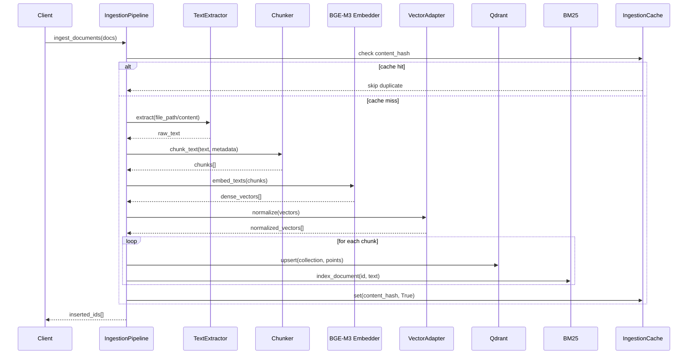
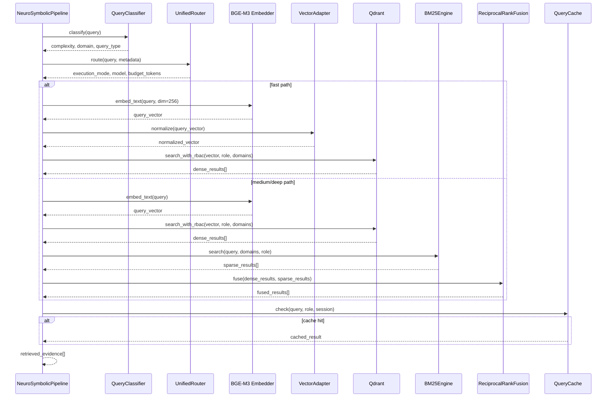
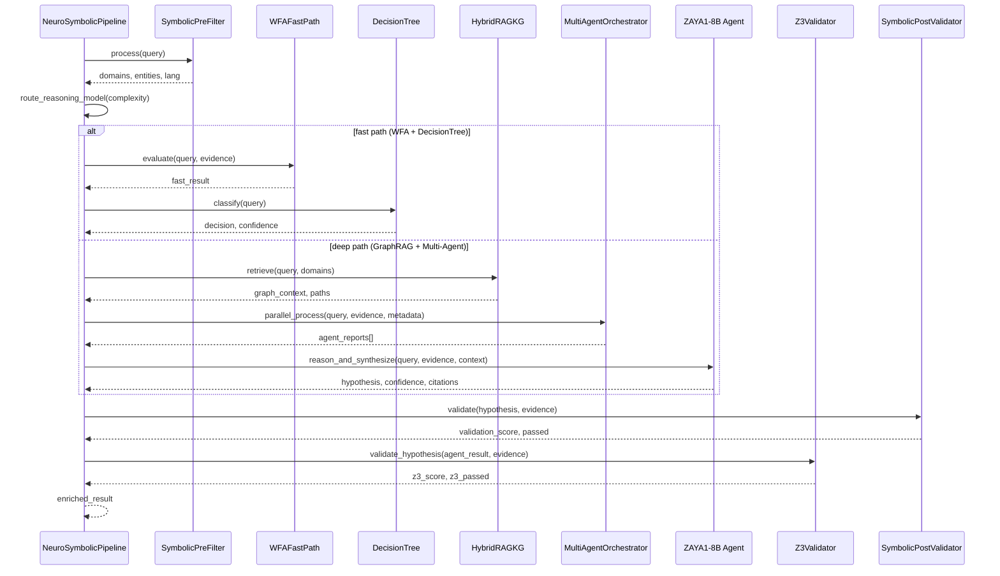
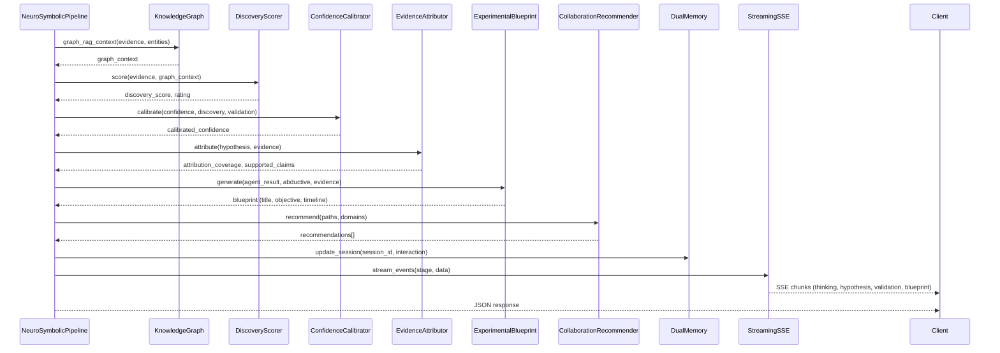

# CrossMind Sequence Flows

## Phase 1: Ingestion Pipeline



## Phase 2: Hybrid Retrieval



## Phase 3: Neuro-Symbolic Reasoning



## Phase 4: Enrichment & Output



## End-to-End Request Flow (Including Frontend)

```mermaid
flowchart TD
    A["User Query"] --> B{UI Path}
    B -->|Streamlit| C["dashboard/app.py<br/>call_api('/api/query')"]
    B -->|React (optional)| D["frontend/src/phases/<br/>fetch('/api/query')"]
    B -->|Direct| E["HTTP POST /api/query"]

    C --> F["FastAPI App<br/>(app/main.py:343 lines)"]
    D --> F
    E --> F

    F --> G["NeuroSymbolicPipeline.process_query()"]
    G --> H["SymbolicPreFilter"]
    H --> I["UnifiedRouter.route()"]
    I --> J{"Execution Mode"}
    J -->|fast| K["WFA + DecisionTree"]
    J -->|medium/deep| L["GraphRAG + MultiAgent + ZAYA1-8B"]
    K --> M["Z3 + PostValidation"]
    L --> M
    M --> N["Enrichment + Memory + Streaming"]
    N --> O["JSON / SSE Response"]

    style F fill:#ccffcc,stroke:#333,stroke-width:2px
    style O fill:#ccffcc,stroke:#333,stroke-width:2px
```

> **Note**: The FastAPI application layer in `app/main.py` is implemented and exports a real `app` object. The HTTP endpoints `/api/query`, `/api/ingest`, `/api/stream_reasoning`, and `/v1/api/*` are bound and active. The sequence diagrams below describe the full flow including the API layer.
